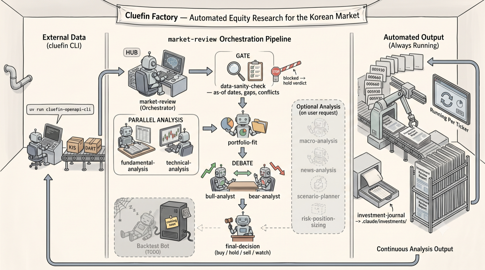

# Cluefin Factory



Cluefin Factory는 한국 시장 투자 리서치 워크벤치입니다.
테슬라의 기가팩토리처럼 기업 분석과 종목 추출을 끊임없이 반복해 내놓는 "공장"을 지향합니다.
별도의 CLI를 만들지 않고, 코딩 에이전트의 project-local resource로 시장 데이터 도구와 분석 워크플로우를 구성합니다.
시장과 종목을 입력하면 데이터 수집부터 기본적/기술적/뉴스/매크로 분석, 데이터 점검, 포트폴리오 적합성, bull/bear 의견, 최종 판단까지 하나의 진입점에서 실행합니다.

Cluefin Factory는 **두 가지 에이전트 런타임**을 지원합니다.

- **[Pi coding agent](https://www.npmjs.com/package/@earendil-works/pi-coding-agent)** — `.pi/` 리소스로 동작 (`npm run chat`)
- **[Claude Code](https://docs.claude.com/en/docs/claude-code)** — `.claude/` 리소스로 동작

Pi 런타임은 `.pi/extensions/market-data/`의 도구로 cluefin CLI를 호출하고,
Claude Code 런타임은 `market-review` 에이전트가 cluefin CLI를 bash로 직접 호출합니다.

## What Cluefin Factory Does

| 구성 | Pi | Claude Code |
| --- | --- | --- |
| 데이터 수집 | Extension `index.ts` (Pi tool) | `market-review` 에이전트가 cluefin CLI를 bash로 직접 호출 |
| 오케스트레이션 | Prompt `/market-review` | `market-review` 서브에이전트 (`.claude/agents/`) |
| 분석 역할 | Skills `.pi/skills/*` | Skills `.claude/skills/*` |

공통적으로 KIS·DART 데이터를 가져오는 도구는 cluefin 프로젝트의 Python CLI(`cluefin-openapi-cli`)를 `uv run`으로 호출합니다.

### Analysis skills

`.pi/skills/`와 `.claude/skills/`에 동일하게 제공됩니다.

| Skill | 역할 |
| --- | --- |
| `fundamental-analysis` | 재무제표, 밸류에이션, 성장성, 수익성, 현금흐름, 부채 구조 |
| `technical-analysis` | 이동평균, 거래량, RSI, MACD, 지지/저항, 추세 전환 |
| `news-analysis` | 뉴스, 공시, 실적, 산업 이벤트를 호재/악재/중립으로 분류 |
| `macro-analysis` | 환율, 미국/한국 금리, 미국채/국고채, 유동성 환경 |
| `data-sanity-check` | 기준일, 누락, 충돌, 종목 식별, 가격 조정 여부 점검 |
| `portfolio-fit` | 기존 포트폴리오와 신규/기존 종목의 적합성 |
| `scenario-planner` | bull / base / bear 시나리오와 조건, 예상 가격 범위 |
| `risk-position-sizing` | 진입가, 손절가, 목표가, 손익비, 포지션 크기 |
| `bull-analyst` | 동일 데이터에서 긍정 투자 논리 구성 |
| `bear-analyst` | 동일 데이터에서 부정 투자 논리 구성 |
| `final-decision` | buy/hold/sell/watch, 기준선, 무효화 조건, 추적 지표 |
| `investment-journal` | 투자 판단과 사후 복기를 `investments/journal/`에 기록 |

### Market data

KIS·DART 데이터는 cluefin CLI(`uv run cluefin-openapi-cli`)로 가져옵니다.
Pi 런타임은 `.pi/extensions/market-data/`의 도구로, Claude Code 런타임은 `market-review`
에이전트가 bash로 직접 호출합니다. 주요 조회 항목:

- 현재가: `kis stock current-price`
- 가격 이력(기술적 분석용): `kis chart period` (장기 구간은 분할 후 병합)
- 재무제표/비율 번들: `kis financial {income-statement,balance-sheet,ratio,growth,profitability,stability}`
- 시장 뉴스/공시 제목: `kis market announcement`
- DART 기업 고유번호: `dart corp-code-lookup`
- DART 기업 개요: `dart company-overview`
- DART 공시 검색: `dart disclosure-search`

## Quick Start

### 1. Clone dependencies

이 저장소는 단독으로 완결되지 않습니다.
시장 데이터 도구는 `cluefin` 저장소의 Python CLI(`cluefin-openapi-cli`)를 `uv run`으로 호출하므로, `cluefin`과 [`uv`](https://docs.astral.sh/uv/)가 함께 필요합니다.

```bash
git clone https://github.com/kgcrom/cluefin-factory
git clone https://github.com/kgcrom/cluefin

cd cluefin-factory
npm install
cp .env.example .env
```

`market-data` 계층은 기본적으로 `~/workspace/cluefin`을 cluefin CLI 실행 경로로 가정합니다.
다른 위치에 clone했다면 `.env`에 `CLUEFIN_OPENAPI_CWD`로 경로를 지정합니다.

```bash
CLUEFIN_OPENAPI_CWD=/path/to/cluefin
```

### 2. Fill environment variables

`.env`에는 데이터 소스 키가 필요합니다.

- `KIWOOM_APP_KEY`, `KIWOOM_SECRET_KEY`, `KIWOOM_ENV`
- `KIS_APP_KEY`, `KIS_SECRET_KEY`, `KIS_ENV`
- `DART_AUTH_KEY`
- `CLUEFIN_OPENAPI_CWD` (cluefin이 `~/workspace/cluefin`이 아닐 때만)

### 3. Run

#### Pi coding agent

```bash
npm run chat
```

`npm run chat`은 Pi coding agent CLI를 `.env`와 함께 실행합니다.
대화형 모드에서 `/market-review` 프롬프트로 투자 검토를 시작합니다.

```text
/market-review KOSPI 005930
/market-review KOSDAQ 247540
```

#### Claude Code

저장소 안에서 Claude Code를 실행하면 `.claude/`의 스킬과 `market-review` 서브에이전트가
자동 등록됩니다. 시장 데이터는 에이전트가 cluefin CLI를 bash로 직접 호출하므로 별도 빌드는
필요하지 않습니다.

```bash
claude          # 저장소 안에서 실행
```

`market-review` 에이전트에 시장/종목을 전달하면 동일한 검토 흐름이 실행됩니다.

```text
> market-review 에이전트로 KOSPI 005930 검토해줘
```

## How It Works

`/market-review`(Pi)와 `market-review` 서브에이전트(Claude Code)는 동일한 순서를 지시합니다.

1. 시장과 종목 식별
2. 기본적 분석 데이터 수집 (가능하면 최근 5개년 연간, 부족하면 최근 12개 기간)
3. 기술적 분석 지표 수집 (`kis chart technical` — CLI가 일봉을 페이징해 지표·신호만 반환, 기본 수정주가)
4. 최근 뉴스 수집
5. 환율, 미국/국내 금리, 채권 등 매크로 데이터 수집
6. `data-sanity-check`로 기준일, 누락, 충돌, 사용 가능 여부 점검
7. `portfolio-fit`로 기존 포트폴리오 적합성 확인
8. `bull-analyst` 긍정 의견
9. `bear-analyst` 부정 의견
10. `final-decision`으로 buy/hold/sell/watch, 기준선, 손절선, 확인 조건 제시
11. 필요 시 `investment-journal` 형식으로 기록 제안

주요 가드레일:

- 데이터가 없으면 없다고 명시하며, 투자 조언이 아닌 의사결정 보조 리포트로 작성합니다.
- `data-sanity-check` 결과가 blocked이면 확정적인 buy/sell 의견을 내지 않습니다.
- KIS API 요청은 동시에 최대 2개로 제한하고, 토큰/호출 제한 오류(exit 5) 시 확정 판단을 미룹니다.
- 명령 경로는 `search`, 파라미터는 `schema`로 확인하며 `list` 전체 덤프는 호출하지 않습니다.
- 기술적 신호는 trend/mean_reversion 두 계열을 따로 읽고 하나의 점수로 합치지 않습니다.
- 사용자의 명시적 요청 없이 `investments/`의 보유 수량, 평균단가, 현금 잔고를 수정하지 않습니다.

## Investments Data

`portfolio-fit`과 `investment-journal` 스킬은 사용자별 로컬 데이터를 읽고 씁니다.
런타임에 따라 `.pi/investments/` 또는 `.claude/investments/`를 사용합니다.

- `portfolio.yaml`, `watchlist.yaml`, `transactions.csv`: 보유/관심 종목과 거래 기록
- `journal/`: 투자 판단과 사후 복기 기록

이 데이터는 개인 자료이므로 커밋하지 않습니다 (`.gitignore`에서 `.pi/investments/`, `.claude/investments/` 모두 제외).

## Repository Layout

```text
.pi/
├── extensions/
│   └── market-data/        # KIS, DART 데이터 도구 — cluefin CLI(uv) 브리지
│       ├── index.ts        # Pi tool 등록 진입점
│       ├── cli.ts          # cluefin-openapi-cli 실행
│       ├── providers/      # kis.ts, dart.ts (런타임 비의존)
│       └── types.ts
├── prompts/
│   └── market-review.md    # /market-review 진입점 프롬프트 (Pi)
└── skills/                 # 분석 역할 스킬 (Pi)
.claude/
├── agents/
│   └── market-review.md    # market-review 서브에이전트 (Claude Code 오케스트레이터)
└── skills/                 # 분석 역할 스킬 (Claude Code, .pi/skills와 동일)
docs/
├── TODO.md                 # 남아 있는 작업 메모
└── assets/                 # 로고 등 정적 리소스
```

## Development

작업을 마친 뒤 아래 검증을 실행합니다.

```bash
npm test       # vitest (--passWithNoTests)
npm run lint   # biome check
npm run format # biome format --write
npm run build  # tsc (Pi 확장 dist/ 생성)
```

## Related Docs

- [docs/TODO.md](docs/TODO.md): `investment-decision` extension 도입 검토 등 남아 있는 작업 메모
